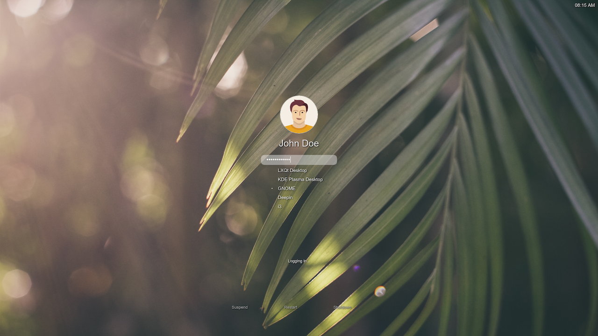

# LightDM Webkit Modern Arch Theme

This is a LightDM webkit greeter theme for Archlinux. Based on [LightDM-Webkit-Archlinux-Theme](https://github.com/shosca/lightdm-webkit-archlinux-theme)

# Installation Instructions

You will need lightdm as your login manager and the lightdm-webkit2-greeter from AUR. You need to make the webkit greeter the default greeter. This is done by editing the lightdm configuration under:

<pre>
/etc/lightdm/lightdm.conf
</pre>

and changing the greeter-session value to lightdm-webkit2-greeter. lightdm.conf should have:

<pre>
[SeatDefaults]
greeter-session=lightdm-webkit2-greeter
allow-guest=false
</pre>

The second step is to install the actual theme. This is done by copying the files to a temporary location and open a terminal in the downloaded folder, type this :

<pre>
./install.sh
</pre>

Finally, change the /etc/lightdm/lightdm-webkit2-greeter.conf file to contain the following line:

<pre>
webkit-theme=ltheme
</pre>

Now you can reboot and enjoy the new theme.

## Screenshots

